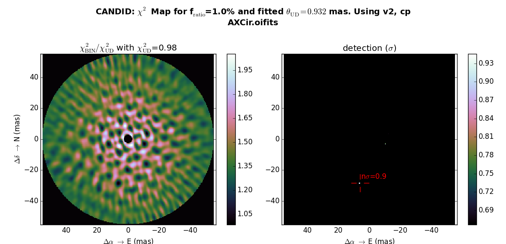
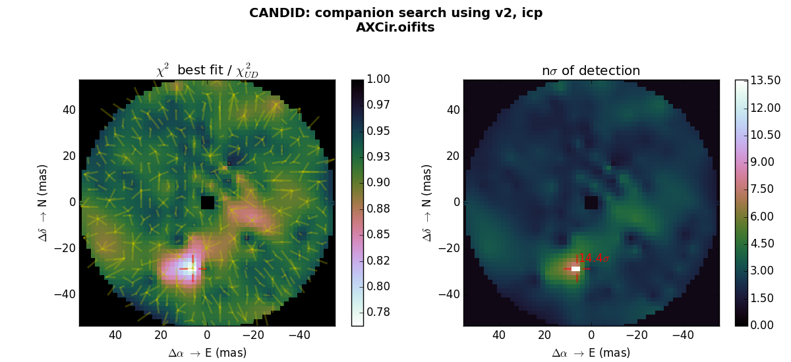
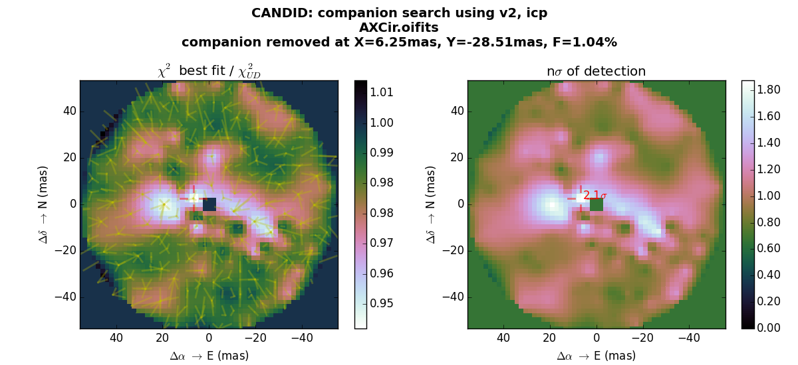
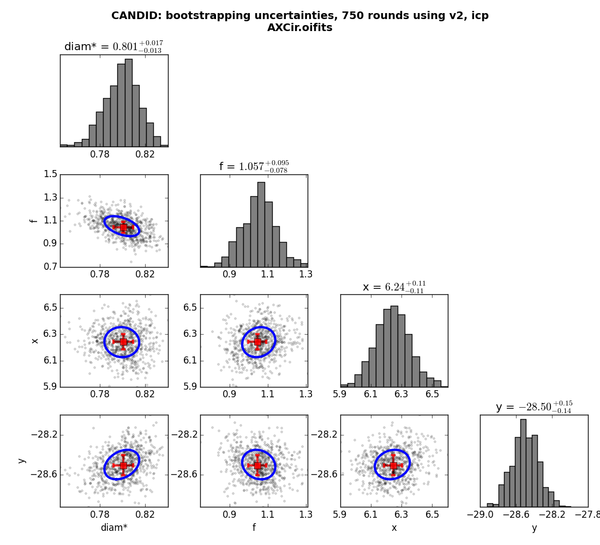
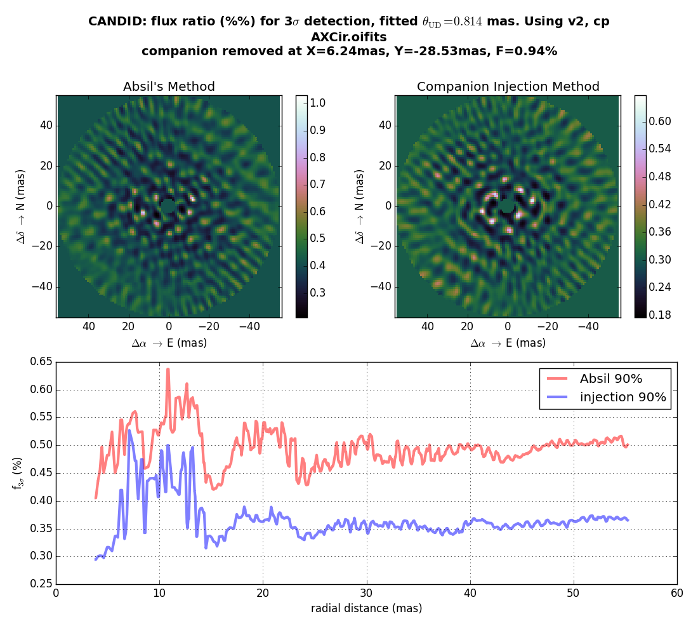

# [C]ompanion [A]nalysis and [N]on-[D]etection in [I]nterferometric [D]ata

This is a suite of Python 2/3 tools to find faint companion around star in interferometric data in the [OIFITS format](http://www.mrao.cam.ac.uk/research/optical-interferometry/oifits/). This tool allows to systematically search for faint companions in OIFITS data, and if not found, estimates the detection limit. This code is presented in the article [Gallenne et al. 2015](http://adsabs.harvard.edu/abs/2015A%26A...579A..68G), although it has evolved slightly since the paper was published.

WARNING: before version 1.0.5 (April 2021), there is a bug in the computation of the statistical significance: the computation are correct below ~4 sigmas, but get progressively overestimated, to double by 14 sigma. In practice, this does not change results, as the significance is only important around or below 4 sigmas.

To install, run:
```
python setup.py install --user
```
it will compile the C source used in Cython, and install CANDID. You may need to install `cython` manually.

## What does it do for you?

### Companion Search

The tool is based on model fitting and Chi2 minimization ([scipy.optimize.leastsq](http://docs.scipy.org/doc/scipy-0.14.0/reference/generated/scipy.optimize.leastsq.html)), with a grid for the starting points of the companion position. It ensures that all positions are explored by estimating a-posteriori if the grid was dense enough, and provide an estimate of the optimum grid density (see example).

Note that if you use [LITpro](http://www.jmmc.fr/litpro_page.htm), you might find that the results given by CANDID are different:
* In general, position of the found companion is the same for LITpro and CANDID
* LITpro tends to overestimate the flux ratio, because it does not take into account bandwidth smearing, whereas CANDID does. For AX Cir, the flux ratio found bt CANDID is 1%, whereas it is 0.8% for LITpro (or CANDID when bandwidth smearing is disabled). Note that the latest versions of CANDID compute numerically the bandwidth smearing to make sure we never run into restrictions of the analytical approximation of Lachaume & Berger (2013). the variable `CONFIG['Nsmear']` is automatically adjusted, so do not try to adjust it yourself.

### Detection limit
It uses Chi2 statistics to estimate the level of detection in "number of sigmas".

### Non-Detection Limit
There are two approaches implemented: [Absil et al. 2011](http://adsabs.harvard.edu/abs/2011A%26A...535A..68A) and CANDID's Analytical Companion Injection [Gallenne et al. 2015](http://adsabs.harvard.edu/abs/2015A%26A...579A..68G).

## Known limitations

The code has *not* been deeply error proofed. If you encounter problems or bugs, do not hesitate to contact the developers.

* **The (non-)detection levels are given assuming the errors bars in the data are uncorrelated**. This is of course not the case for real data, in particular when a lot of spectral channels are present.
* The works only with simple OIFITS files: all observations should be with the same instrument (same OI_WAVELENGTH) and all data will be taken, assuming a single target is present. Several OIFITS files can be loaded at once (giving a list of files) but it assumes that all files contain only one target.
* The UD visibility is computed using a polynomial approximation, so only first and second lobe visibilities for the primary can be handled. That should be enough but might lead to some (unknown yet) side effects.
* The code has been tested of OIFITS files form CHARA/MIRC and VLTI/PIONIER. If you use other instruments and encounter problems, please contact the developers!
* The code can take lots of memory because it stores lots of intermediate results, so using a 64bit python is advisable.
* The code is not particularly fast, but uses [multiprocessing](https://docs.python.org/2/library/multiprocessing.html): our experience on Macs is that it leads to several problems:
 * It does not work properly with IPython Notebooks. [It seems to be known](https://github.com/ipython/ipython/issues/6109).
 * It works better with the IPython console, though it sometimes seems unresponsive (it makes sometimes the estimation of running time unreliable). Moreover, ctrl+C sometimes does not stop the code.
 * The smoothest behavior is obtained by running in a python shell.

## Examples:

The following example can be found in [axcir.py](axcir.py).

* **chi2 Maps**. These are useful because fast, but dangerous because it is easy to miss a companion just using those. On FIG1 and FIG2, we show to runs for different diameters and flux ratio: either the diameter is fitted to the V2 data ([FIG1](doc/figure_1.png)). The chi2 map shows a minimum only if the grid if fine enough (the structure in the map should be clear, not pixelated) but also if the parameters (inc. the flux ratio) are very close to the actual ones.
* **fit Maps**. These are **MUCH** better, but slower than chi2 maps. If V2 are present, the diameter will be fitted ([FIG2](doc/figure_2.png)). Note that once a companion is found, it can be removed analytically from the data and the fit map ran again ([FIG4](doc/figure_4.png)): this demonstrates that, in the case of our example, the secondary "detections" are only artifact from the main companion.
* **detection limits**. We implemented 2 methods; Absil's and our companion injection ([Gallenne et al. 2015](http://arxiv.org/abs/1505.02715)). Note that they give slightly different results: we argue that our method is more robust to correlated noise (read our paper!). When you have detected a companion and wish to estimate the detection limit, it is important to first remove the companion ([FIG5](doc/figure_5.png)).

**We strongly recommend you use plain python2.7, instead of iPython, because of the bad interactions between iPython and the multiprocessing library, which makes the estimation of the running time very unreliable.**

### Open OIFITS file with CANDID:

```
>>> import candid
>>> o = candid.Open('AXCir.oifits')
 > loading file AXCir.oifits
 | WARNING: no valid T3AMP values in this HDU
 | WARNING: no valid T3AMP values in this HDU
 | Smallest spatial scale:       2.68 mas
 | Diffraction Field of view:  221.88 mas
 | WL Smearing Field of view:   55.24 mas
 | observables available: [ 'v2', 'cp']
 | instruments: [ 'VLTI-PIONIER_Pnat(1.6135391/1.7698610)']
 | rmin= not given, set to smallest spatial scale: rmin= 2.68 mas
 | rmax= not given, set to Field of View: rmax=55.24 mas
```

One might want to limit the observables and/or instrumental setups fitted. VLTI/GRAVITY data, for example, provide no meaningful closure amplitude. If our "o" variable was from a GRAVITY dataset, one should add `o.observables=['cp','v2']; o.instruments = ['SPECTRO_FT']` after opening the file in order to limit the following fits to phase closure and V2, as well as instrument to the fringe tracker (or `o.instruments = ['SPECTRO_SC']` for the science spectrograph, but very slow...).

### CHI2MAP: fitted diameter and fixed flux ratio=1%:
The easiest thing to try is a chi2 map, assuming a certain flux ratio for the companion. This is quite inefficient but CANDID allows to do it. If no parametrization is given (step size 'step=', maximum radius for search 'rmax'), CANDID will guess some values based on the angular resolution and the wavelength smearing field of view. The flux ratio is given in percent.

```
>>> o.chi2Map(fig=1, fratio=1.0)
 > step= not given, using 1/4 X smallest spatial scale = 0.67 mas
 > observables: ['v2', 'cp']
 > UD diam Fit
 | best fit diameter: 0.932 +- 0.006 mas
 | chi2 = 0.975
 |================================================== | 99%   0 s remaining
 | chi2 Min: 0.959
 | at X,Y  :   6.38, -28.55 mas
 | NDOF=1499  > n sigma detection:  0.99 (fully uncorrelated errors)
```



### FITMAP:
Doing a grid of fit is much more efficient than doing a simple Chi2 Map ([FIG1](doc/figure_1.png)). In a FITMAP, a set of binary fits are performed starting from a 2D grid of companion position. The plot displays the interpolated map of the chi2 minima (left), with the path of the fit, from start to finish (yellow lines). FITMAP will compute, a posteriori, what was the correct step size `step=`. In our example below, we let CANDID chose the step size, based on the angular resolution of the data (1.2 wavelength/baseline). The companion is detected at the same position as for the previous example, with a much better dynamic range.
```
>>> o.fitMap(fig=2)
 > step= not given, using sqrt(2) x smallest spatial scale = 3.78 mas
 > observables: ['v2', 'cp']
 > Preliminary analysis
 > UD diam Fit
 | best fit diameter: 0.932 +- 0.006 mas
 | chi2 = 0.975
 |================================================== |  99%   0 s remaining
 | Computing map of interpolated Chi2 minima
 | 195 individual minima for 643 fits
 | 10, 50, 90 percentiles for fit displacement: 1.2, 3.1, 6.1 mas
 | Grid has the correct steps of 3.78mas,  optimimum step size found to be 4.26mas
 | Rbf interpolating: 195 points -> 3721 pixels map
 > BEST FIT 0: chi2= 0.73
 |     x=   6.2468 +- 0.0580 mas
 |     y= -28.5056 +- 0.1017 mas
 |     f=   1.0411 +- 0.0472 %
 | diam*=   0.8007 +- 0.0088 mas
 | chi2r_UD=0.98, chi2r_BIN=0.73, NDOF=1499 -> n sigma: 14.37 (assumes uncorr data)
```


FITMAP allows to provide additional parameters, as well as fixing parameters in the fit. Additional parameters are passed using `addParam={'diamc':0.5, 'fres':0.1}` for a resolved flux of 10% (of the centra star's flux) and a companion angular diameter of 0.5mas. If ones want to prevent fitting parameters, `doNotFit=['fres', 'diamc']`.

### ERROR BARS by bootstrapping:
In order to better estimate the uncertainties on the companion we found, we can use bootstrapping to estimate the uncertainties around the best fit parameters. The default starting is the best fitted position: since we made a fit with an analytical removal of the companion, the currently stored companion is not the one found on Fig2; thankfully we stored it in the variable 'p'.

On the correlations plots, the red dot with error bars is the fitted position; the blue ellipses are derived from the bootstrap (using a principal component analysis); the values given for each parameters are the median; the uncertainties are the 16% and 84% percentile (one sigma).

```
>>> o.fitBoot(fig=3)
 > 'N=' not given, setting it to Ndata/2
 |================================================== |  99%   0 s remaining
 > sigma clipping in position and flux ratio for nSigmaClip= 3.5
 | 0 fits ignored
 |    diam* =   0.8002 + 0.0144 - 0.0153 mas
 |        f =   1.0483 + 0.0891 - 0.0895 %
 |        x =   6.2435 + 0.1029 - 0.1183 mas
 |        y = -28.5068 + 0.1419 - 0.1686 mas
```



FITBOOT, similar to FITMAP, accepts the `doNotFit=` input as a list of non-fitted parameters.


### FITMAP, after analytically removing companion
CANDID offers the possibility, once a companion has been detected, to remove it analytically from the data and rerun a FITMAP. This allows to estimate the dynamic range of the data set, but also to detect fainter tertiary components. fitMap stores the best fit in the dictionary bestFit, which key best contains the dictionary containing the parameters. Note that `o.bestFit['uncer']` contains the corresponding error bars.

```
>>> p = o.bestFit['best']
>>> o.fitMap(fig=4, removeCompanion=p)
 > step= not given, using sqrt(2) x smallest spatial scale = 3.78 mas
 > observables: ['v2', 'cp']
 > Preliminary analysis
 > UD diam Fit
 | best fit diameter: 0.800 +- 0.006 mas
 | chi2 = 0.739
 |================================================== |  99%   0 s remaining
 | Computing map of interpolated Chi2 minima
 | 189 individual minima for 643 fits
 | 10, 50, 90 percentiles for fit displacement: 1.2, 3.3, 7.5 mas
 | current grid step (3.69mas) is too fine!!! --> 4.62mas should be enough
 | Rbf interpolating: 189 points -> 3721 pixels map
 > BEST FIT 0: chi2= 0.69
 |     x=   6.6809 +- 0.1332 mas
 |     y=   2.4402 +- 0.1770 mas
 |     f=   0.3640 +- 0.0381 %
 | diam*=   0.7332 +- 0.0097 mas
 | chi2r_UD=0.74, chi2r_BIN=0.69, NDOF=1499 -> n sigma:  2.02 (assumes uncorr data)
```



### DETECTION LIMIT, after analytically removing companion:
We here remove the companion analytically from the V2 and CP data. This is mandatory in order to estimate the detection limit: the statistical hypothesis of the test is that the data are best described by a uniform disk.

```
>>> o.detectionLimit(fig=5, step=1.5, removeCompanion=p)
 > step= not given, using 1/2 X smallest spatial scale = 1.34 mas
 > observables: ['v2', 'cp']
 > UD diam Fit
 | best fit diameter: 0.800 +- 0.006 mas
 | chi2 = 0.739
 > Detection Limit Map 83x83
 > Method: Absil
 |================================================== | 99%   0 s remaining
 > Method: injection
 |================================================== | 99%   0 s remaining
```


### CONFIG parameters

A global dictionary CONFIG to set parameters. The list of default parameters is shown each time the library is loaded. To modify the parameters, you should do it as such:
```
>>> candid.CONFIG['longExecWarning'] = 300
```
This will, for example, set the maximum computing time to 300s (instead of the default 180s). Note that this will have to be done every time you import or reload the library.

## Performances

Note that with the release of SciPy 1.9, `scipy.weave` has been phased out, hence CANDID has taken a hit in terms of performances by reversing to Numpy. Starting in version 0.3 of CANDID (early 2018), Cython is used to accelerate by a factor 2 over Numpy. It is not as fast as `scipy.weave` but still twice as fast as Numpy.

### Multiprocessing

CANDID is parallelized and the number of core used can be set. By default, it will use all the cores: `candid.CONFIG['Ncores'] = None`. One can set manually how many cores to be used:
```
>>> candid.CONFIG['Ncores'] = 8
```
will use 8 processes, or the actual number of cores present on your machine if you have less than 8 cores. To know how many cores you have, run:

```
>>> import multiprocessing
>>> multiprocessing.cpu_counts()
```

Because not all computation are parallelized and there are some overheads due to the 'multiprocessing' library, the gain is not linear with the number of cores used. The measured speedups (on a 96 cores machine) for `fitMap` and `detectionLimit` are:

|N cores:         | 1 | 4  | 8 | 16 | 32 | 64 |
|-----------------|---|----|---|----|----|----|
|`fitMap`         | 1 | 3.5| 7 | 11 | 15 | 16 |
|`detectionLimit` | 1 | 3.5| 6 |  8 |  9 | 10 |

8 cores is hence a good compromise. The gains match [Amdhal's law](https://en.wikipedia.org/wiki/Amdahl%27s_law) for 96% of `fitMap` being parallelized. The fraction for `detectionLimit` is roughly 92%.

## Informations

### Link
https://github.com/amerand/CANDID

### Developpers
[Antoine Mérand](mailto:amerand-at-eso.org) and [Alexandre Gallenne](mailto:agallenn-at-eso.org)

### Python dependencies
Python 2.7 or 3.7, Numpy, Scipy, Matplotlib and astropy (for reading FITS files).


### LICENCE (BSD)

Copyright (c) 2015-2018, Antoine Mérand
All rights reserved.

Redistribution and use in source and binary forms, with or without
modification, are permitted provided that the following conditions are met:

1. Redistributions of source code must retain the above copyright notice, this
   list of conditions and the following disclaimer.
2. Redistributions in binary form must reproduce the above copyright notice,
   this list of conditions and the following disclaimer in the documentation
   and/or other materials provided with the distribution.

THIS SOFTWARE IS PROVIDED BY THE COPYRIGHT HOLDERS AND CONTRIBUTORS "AS IS" AND
ANY EXPRESS OR IMPLIED WARRANTIES, INCLUDING, BUT NOT LIMITED TO, THE IMPLIED
WARRANTIES OF MERCHANTABILITY AND FITNESS FOR A PARTICULAR PURPOSE ARE
DISCLAIMED. IN NO EVENT SHALL THE COPYRIGHT OWNER OR CONTRIBUTORS BE LIABLE FOR
ANY DIRECT, INDIRECT, INCIDENTAL, SPECIAL, EXEMPLARY, OR CONSEQUENTIAL DAMAGES
(INCLUDING, BUT NOT LIMITED TO, PROCUREMENT OF SUBSTITUTE GOODS OR SERVICES;
LOSS OF USE, DATA, OR PROFITS; OR BUSINESS INTERRUPTION) HOWEVER CAUSED AND
ON ANY THEORY OF LIABILITY, WHETHER IN CONTRACT, STRICT LIABILITY, OR TORT
(INCLUDING NEGLIGENCE OR OTHERWISE) ARISING IN ANY WAY OUT OF THE USE OF THIS
SOFTWARE, EVEN IF ADVISED OF THE POSSIBILITY OF SUCH DAMAGE.
